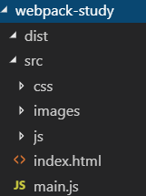

##### webpack




###### 1、npm init -y


###### 2、npm i jquery -S

多了2个文件和一个文件夹


###### 3、js导入

不建议在index.html引入css和任何包，因为这样静态太多，加载慢。

main.js：

```js
import $ from 'jquery'
```

index.html:

```html
<script src="./main.js"></script>
```

这时有报错，没有效果，原因：import *** from *** 是ES6中导入模块的方式，由于 ES6的代码，太高级了，浏览器解析不了，所以，这一行执行会报错。

**解决方法：**

webpack .\src\main.js-o .\dist\bundle.js

前提装好了webpack，具体看day5.md（我是先cmd中npm i webpack -g，然后在项目根目录中npm i webpack --save-dev，反正装了两次，我不清楚为什么，大概第二个是依赖，我不搞第二个，就报错，和视频不一样我也很绝望啊啊啊啊啊啊啊）

注意：如果输入webpack指令时，老被要求装cli，请尝试全局安装一下，npm install webpack-cli -g。


dist中多了个js文件


修改index.html:

```html
<script src="../dist/bundle.js"></script>
```

就有效果了：


###### 4、配置自动webpack

新建一个webpack.config.js


指定 入口、出口 和 文件名称

```js
const path = require('path')

// 这个配置文件，起始就是一个 JS 文件，通过 Node 中的模块操作，向外暴露了一个 配置对象
module.exports = {
    mode: 'none',
    // 需要手动指定 入口、出口 和 文件名称 
    entry: path.join(__dirname, './src/main.js'),
    output: {
        path: path.join(__dirname, './dist'),
        filename: 'bundle.js'
    }
}
 
```

改个颜色，执行：webpack


###### 5、代替4的方法——webpack-dev-server

这个是实时的。

项目根目录下npm i webpack-dev-server -D（视频中是cnpm i webpack-dev-server -D，我没装，就直接用npm）

*ps:* 

*node  nodemon*

*webpack  webpack-dev-server*

如图在package.json中加一行代码："dev": "webpack-dev-server"


记得在项目根目录下npm i webpack -D

执行：

cls

npm run dev


其实index.html中引用的是**根路径的bundle.js**（

```html
<script src="../bundle.js"></script>
```

），但在目录中找不到，因为，没有存在磁盘上，存在内存中。


###### 6、webpack-dev-server常用的命令参数——方法一

如果想自动打开浏览器+自定义端口+打开就是index.html：

如图修改package.json代码："dev": "webpack-dev-server -**-open --port 3000 --contentBase src**"

ctrl+c终止前面的运行

重新执行npm run dev

就会自动打开浏览器了


实现页面无刷新，减少代码更新：

如图修改package.json代码："dev": "webpack-dev-server --open --port 3000 --contentBase src **--hot**"


###### 7、webpack-dev-server常用的命令参数——方法二

如图修改package.json代码："dev": "webpack-dev-server"


在webpack.config.js添加代码：

```js
// 启用热更新的 第2步
const webpack = require('webpack')
```


```js
devServer: { // 这是配置 dev-server 命令参数的第二种形式，相对来说，这种方式麻烦一些
    //  --open --port 3000 --contentBase src --hot
    open: true, // 自动打开浏览器
    port: 3000, // 设置启动时候的运行端口
    contentBase: 'src', // 指定托管的根目录
    hot: true // 启用热更新 的 第1步
},
plugins: [ // 配置插件的节点
    new webpack.HotModuleReplacementPlugin()
]
```


ctrl+c终止前面的运行

重新执行npm run dev


###### 8、html-webpack-plugin插件的两个基本作用

项目根目录下，npm i html-webpack-plugin -D

在webpack.config.js添加代码：

```js
// 导入在内存中生成 HTML 页面的 插件
// 只要是插件，都一定要 放到 plugins 节点中去
// 这个插件的两个作用：
//  1. 自动在内存中根据指定页面生成一个内存的页面
//  2. 自动，把打包好的 bundle.js 追加到页面中去
const htmlWebpackPlugin = require('html-webpack-plugin')
```

```js
plugins: [ // 配置插件的节点
        new webpack.HotModuleReplacementPlugin(),

        new htmlWebpackPlugin({ // 创建一个 在内存中 生成 HTML  页面的插件
            template: path.join(__dirname, './src/index.html'), // 指定 模板页面，将来会根据指定的页面路径，去生成内存中的 页面
            filename: 'index.html' // 指定生成的页面的名称
        })
]
```

index.js注释掉

```html
<script src="../bundle.js"></script>
```

因为这个插件已经自动把bundle.js导入了。


###### 9、loader——配置处理css样式表的第三方loader

main.js:

import './css/index.css'

报错


解决方法：

项目根目录装两个包：npm i style-loader css-loader -D

在webpack.config.js添加代码：

```js
module: { // 这个节点，用于配置 所有 第三方模块 加载器 
        rules: [ // 所有第三方模块的 匹配规则
            { test: /\.css$/, use: ['style-loader', 'css-loader'] }, //  配置处理 .css 文件的第三方loader 规则
        ]
}
```


###### 10、loader——配置文件less文件的loader

main.js:

import './css/index.less'

报错


解决方法：

项目根目录装两个包：npm i less-loader -D    npm i less

在webpack.config.js添加代码：

```js
module: { // 这个节点，用于配置 所有 第三方模块 加载器 
        rules: [ // 所有第三方模块的 匹配规则
            { test: /\.css$/, use: ['style-loader', 'css-loader'] }, //  配置处理 .css 文件的第三方loader 规则
            { test: /\.less$/, use: ['style-loader', 'css-loader', 'less-loader'] }, //配置处理 .less 文件的第三方 loader 规则
        ]
}
```


###### 11、loader——配置文件scss文件的loader

main.js:

import './css/index.scss'

报错


解决方法：

项目根目录装两个包：npm i sass-loader -D    cnpm i node-sass -D

##### 在webpack.config.js添加代码：

```js
module: { // 这个节点，用于配置 所有 第三方模块 加载器 
        rules: [ // 所有第三方模块的 匹配规则
            { test: /\.css$/, use: ['style-loader', 'css-loader'] }, //  配置处理 .css 文件的第三方loader 规则
            { test: /\.less$/, use: ['style-loader', 'css-loader', 'less-loader'] }, //配置处理 .less 文件的第三方 loader 规则
            { test: /\.scss$/, use: ['style-loader', 'css-loader', 'sass-loader'] }, // 配置处理 .scss 文件的 第三方 loader 规则
        ]
}
```

